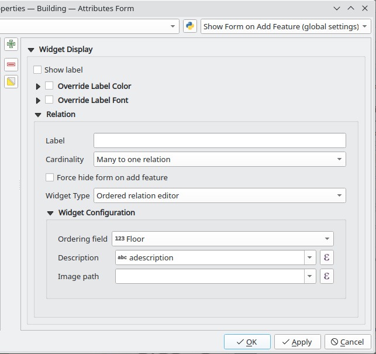

# Ordered Relation Editor plugin for QGIS

A plugin providing a relation editor widget with capability to reorder linked children based on an ordering field.

## Configuration

In the attribute form configuration select `Ordered relation editor` and configure the widget under Widget Configuration:

- **Ordering Field** Which field of the linked table is used for ordering.
- **Description** This expression provides the text displayed in the children list.
- **Image path** Optionally a path to an image or icon to display near the Description text.

